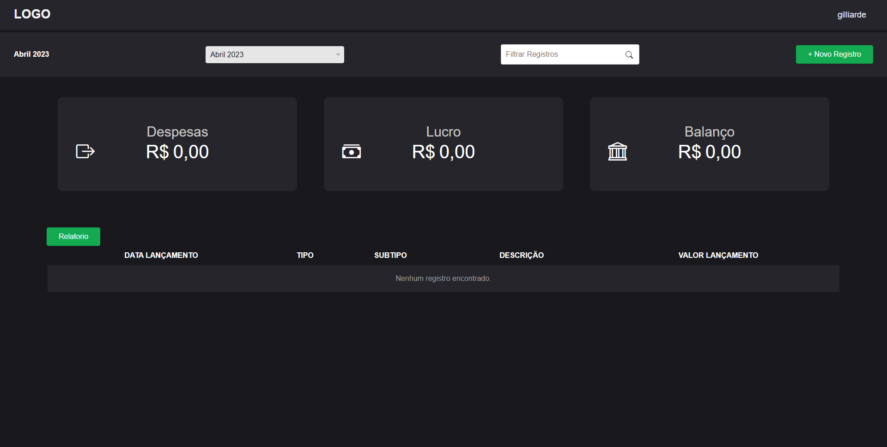
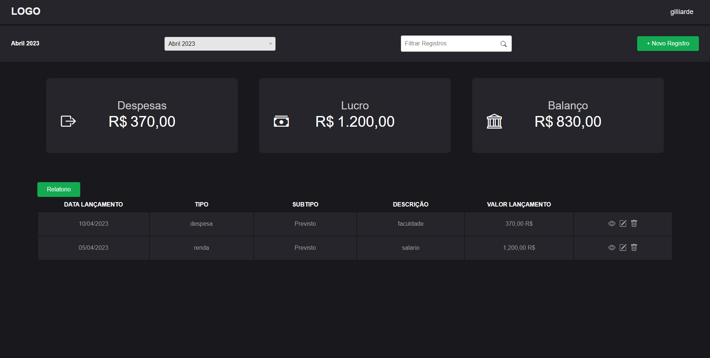
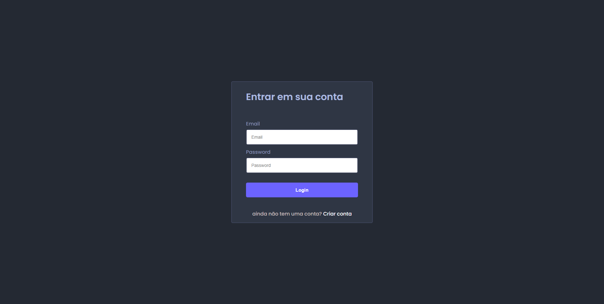
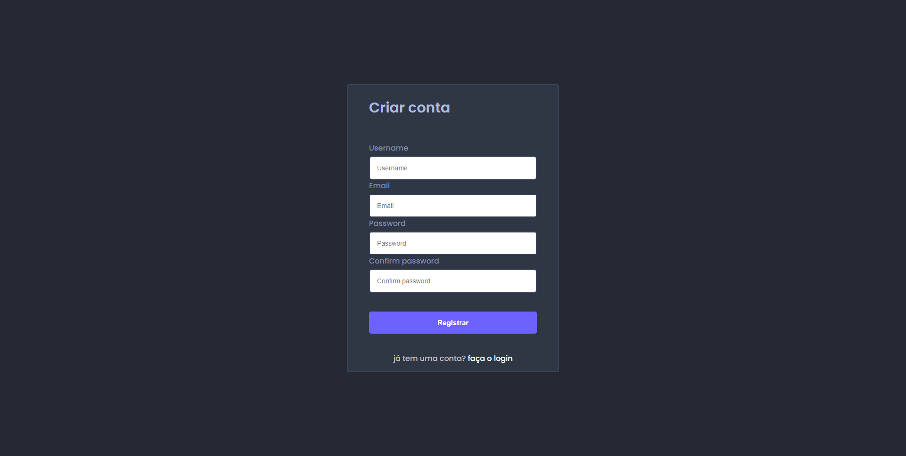

<h1 align="center">
💵 sistema de gestão financeira
</h1>





> Este é um projeto de software para um sistema de gestão financeira que permite o controle de despesas e receitas mensais. O sistema conta com funcionalidades de cadastro de usuários, login e armazenamento de dados em um banco de dados, bem como relatórios mensais de lucro e despesas e lançamentos de movimentações financeiras.

<hr>

<h1>🛠 funcionalidades</h1>

- Cadastro de usuários
- Login de usuários
- Armazenamento de dados em um banco de dados (MySQL)
- Relatório mensal de lucro e despesas
- Lançamento de movimentações financeiras
- Cadastro de usuários
<hr>


## Login de usuários
> O usuário informa o email e a senha cadastrados para acessar o sistema. O sistema verifica se o email informado possui cadastro e, em caso positivo, verifica se a senha informada é a mesma cadastrada para o email encontrado. Em caso positivo, o login é feito com sucesso e o usuário é redirecionado para a página inicial do sistema. Em caso negativo, o sistema informa ao usuário que a senha informada não está correta. Se o email informado não possui cadastro no sistema, o usuário é informado e pode fazer um novo cadastro.

<hr>

## O cadastro de usuários
>é feito através de um formulário que solicita o nome, email, senha e confirmação de senha. O campo senha deve conter pelo menos 6 dígitos, ser idêntico ao campo de confirmação de senha e conter pelo menos um número e um caractere especial. O sistema verifica se o email informado já possui cadastro e, em caso positivo, não permite um novo cadastro. Em caso de falha em alguma validação, o cadastro não é concluído e o usuário é informado das informações incorretas.

<hr>


## Armazenamento de dados em um banco de dados
>O cadastro de usuários e as movimentações financeiras são armazenados em um banco de dados, que pode ser MySQL, SQL ou MongoDB. A senha é salva com algum tipo de criptografia, tornando-se uma string ilegível ao ser humano. O campo de confirmação de senha não é salvo no banco, apenas é usado para validar se o usuário digitou corretamente a mesma senha duas vezes.

<hr>

## Relatório mensal de lucro e despesas
>Na página inicial do sistema, é possível visualizar um relatório mensal de lucro e despesas, bem como o balanço final do mês. O usuário pode filtrar os dados visíveis na tela, contemplando as informações disponíveis, e ver os dados em formato de gráfico.

<hr>

## Lançamento de movimentações financeiras
>O usuário pode criar um novo lançamento financeiro, informando o tipo (despesa ou renda), subtipo (previsto ou extra), data do lançamento (atual ou retroativo), descrição breve do lançamento, descrição longa do lançamento e valor do lançamento em reais. O campo de valor é mascarado para que o usuário só precise digitar o valor e a máscara formate para a moeda brasileira 

<hr>


## Instruções para criar o banco de dados 🏦

<br>

1. Crie um banco de dados chamado `teste-de-faixa` usando o seguinte comando SQL:

    ```
    CREATE DATABASE `teste-de-faixa`;
    ```

2. Crie uma tabela chamada `users` usando o seguinte comando SQL:

    ```
    CREATE TABLE `users` (
      `id` int NOT NULL AUTO_INCREMENT,
      `user_name` varchar(255) NOT NULL,
      `email` varchar(255) NOT NULL,
      `password` varchar(255) NOT NULL,
      PRIMARY KEY (`id`)
    ) ENGINE=InnoDB DEFAULT CHARSET=utf8mb4;
    ```

3. Crie uma tabela chamada `releases` usando o seguinte comando SQL:

    ```
    CREATE TABLE `releases` (
      `id` int NOT NULL AUTO_INCREMENT,
      `user_id` int NOT NULL,
      `datetime` date NOT NULL,
      `type` varchar(255) NOT NULL,
      `subtype` varchar(255) NOT NULL,
      `description` varchar(255) NOT NULL,
      `long_description` text NOT NULL,
      `launch_value` decimal(10,2) NOT NULL,
      PRIMARY KEY (`id`),
      KEY `fk_user_id` (`user_id`),
      CONSTRAINT `releases_ibfk_1` FOREIGN KEY (`user_id`) REFERENCES `users` (`id`) ON DELETE CASCADE
    ) ENGINE=InnoDB DEFAULT CHARSET=utf8mb4;

<br>

 Certifique-se de configurar corretamente as informações de conexão no seu projeto, incluindo o endereço, o nome do banco de dados e as credenciais de acesso. Isso garante que seu sistema de gestão financeira possa se conectar ao banco de dados e armazenar as informações corretamente.

Não se esqueça de atualizar essas informações sempre que necessário, por exemplo, caso você mude de provedor de hospedagem ou precise migrar o banco de dados para um servidor diferente.

Espero que essas dicas sejam úteis! 💻
